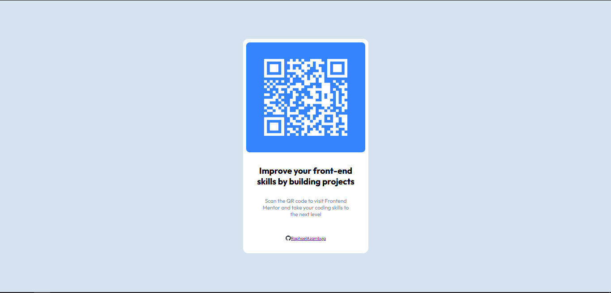
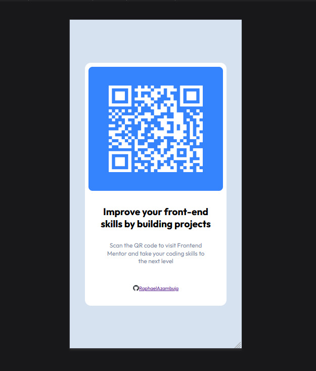

# QR-code-component

This is my first [Frontend Mentor](https://www.frontendmentor.io/home) challenge. I created a simple screen to share the site. Although I slightly deviated from the proposal, I completed it more comprehensively, using a real QR code with a direct link to the Frontend Mentor website.

## Used Tools

## My Networks

## Playlist listened while coding

